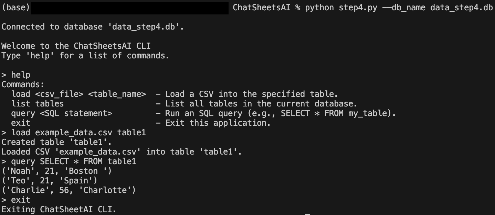
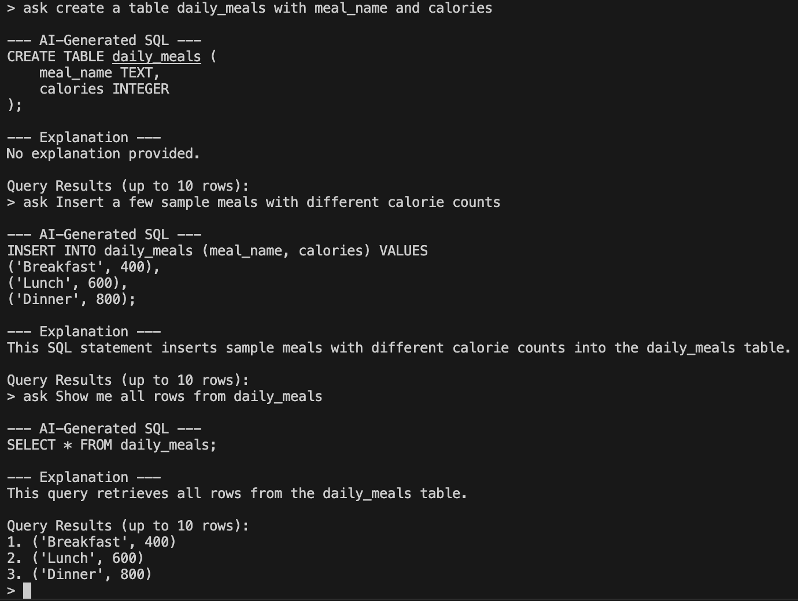

# ChatSheetsAI

Create a spreadsheet-like application (similar to Excel or Google Sheets) but entirely driven by a chat interface.

---

## Step 1


Manually load a CSV into SQLite and perform basic queries.

---

## Step 2


Infer schema from a CSV and create tables automatically.

---

## Step 3

If there are any differences between the CSV columns and the existing table columns, prompt the user to overwrite, rename, or skip.


---

## Step 4



Create a simple CLI that allows basic chat-like interaction: load CSV, list tables, run SQL queries, etc.

---

## Step 5



Integrate OpenAI to convert natural language queries into SQL commands.

---

### Quick Start
1. clone the repo

2. run ```pip install -r requirements.txt```

3. run the (for example) step1 script:<br>
```python step1.py --csv_file example_data.csv --db_name data.db```