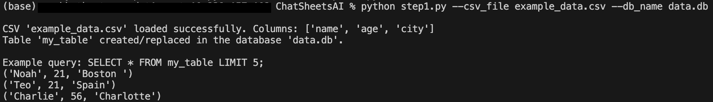
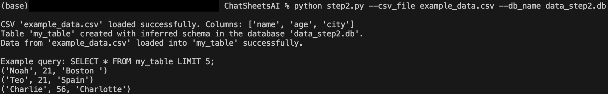
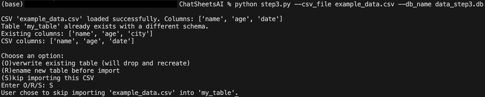

# ChatSheetAI

Create a spreadsheet-like application (similar to Excel or Google Sheets) but entirely driven by a chat interface. 

---

## Step 1



---

## Step 2



---

## Step 3

If there are any differences between the CSV columns and the already made table columns: 


---

### Quick Start
1. clone the repo

2. run ```pip install -r requirements.txt```

3. run the (for example) step1 script:<br>
```python step1.py --csv_file example_data.csv --db_name data.db```
